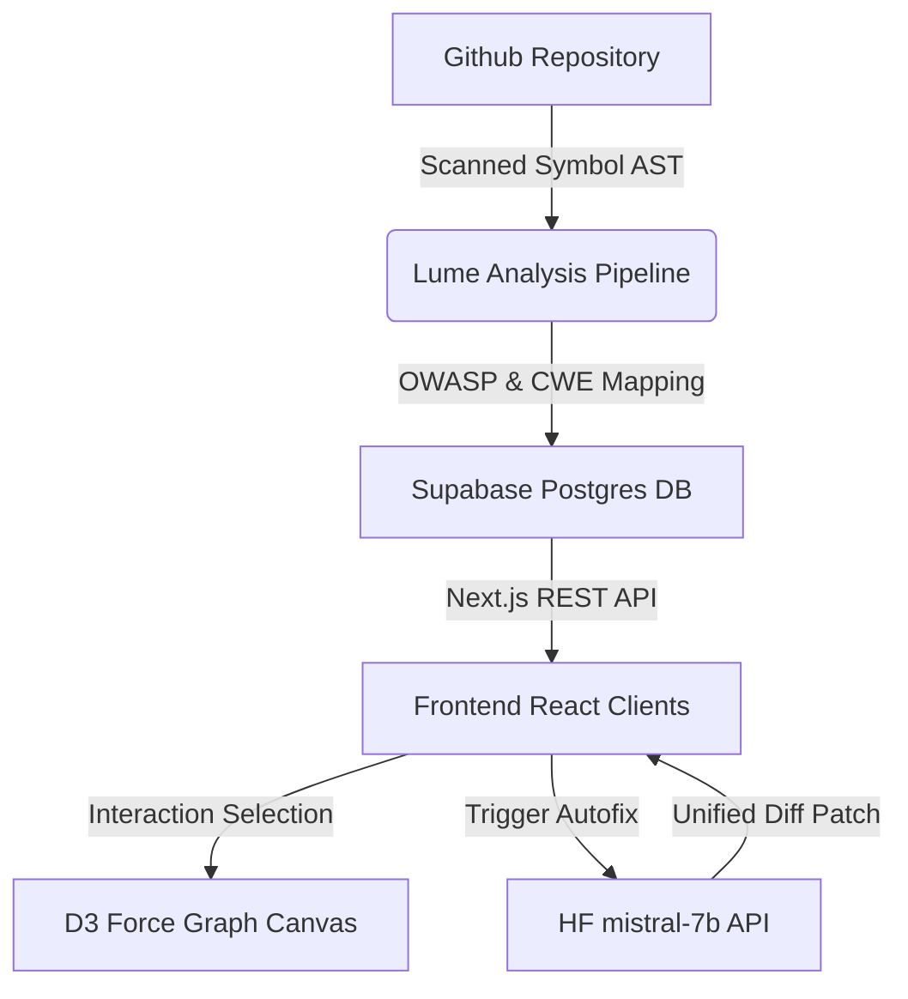
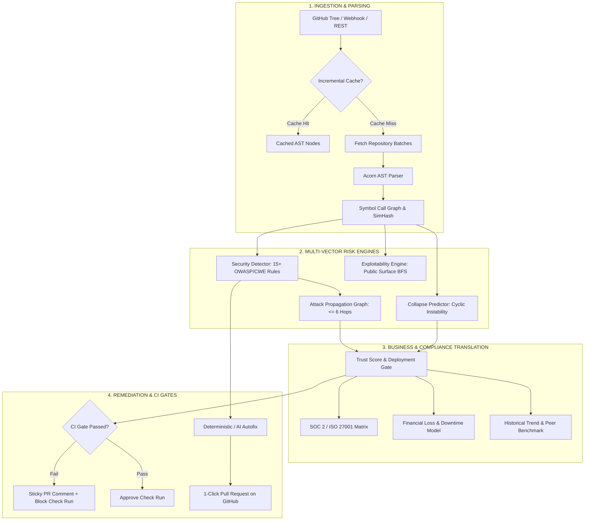

# 🛰️ DebtRadar (Lume)

> **AI-Powered Software Trust, Risk Intelligence & CI/CD Gate Platform.**  
> Transform complex codebase ASTs, multi-hop vulnerability attack chains, and architectural fragility into unified, actionable trust verdicts and executive business signals.

[](https://nextjs.org/)
[](https://www.typescriptlang.org/)
[](https://tailwindcss.com/)
[](https://d3js.org/)
[](https://supabase.com/)
[](https://huggingface.co/)
[](https://debtradar.io)

---

## 📖 Table of Contents
- [Overview](#-overview)
- [Architecture & Tech Stack](#️-architecture--tech-stack)
- [End-to-End Analysis Pipeline](#-end-to-end-analysis-pipeline)
- [Key Features & Engines](#-key-features--engines)
  - [1. D3-Powered Codebase Galaxy & Attack Graph](#1-d3-powered-codebase-galaxy--attack-graph)
  - [2. Exploitability & BFS Shortest Attack Paths](#2-exploitability--bfs-shortest-attack-paths)
  - [3. Architectural Collapse Prediction](#3-architectural-collapse-prediction)
  - [4. Deterministic Autofix & 1-Click Pull Requests](#4-deterministic-autofix--1-click-pull-requests)
  - [5. Executive Trust Score & Business Translation](#5-executive-trust-score--business-translation)
  - [6. SOC 2 / ISO 27001 Compliance Matrix & Export](#6-soc-2--iso-27001-compliance-matrix--export)
  - [7. Longitudinal Trends & Peer Benchmarking](#7-longitudinal-trends--peer-benchmarking)
  - [8. GitHub Webhooks & CI/CD Deployment Gate](#8-github-webhooks--cicd-deployment-gate)
- [Public Developer REST API v1](#-public-developer-rest-api-v1)
- [1-Click Interactive Demo Presets](#-1-click-interactive-demo-presets)
- [Getting Started](#-getting-started)
- [Environment Variables](#-environment-variables)
- [Testing & Quality Verification](#-testing--quality-verification)

---

## 🌟 Overview

Modern engineering teams struggle with alert fatigue from noisy static analysis linters that generate thousands of disjointed warnings without context. **DebtRadar** introduces an architectural shift:
1. **Graph Exploitability:** Traces whether public entry points can actually reach internal critical vulnerabilities via BFS shortest-path graph traversal (≤ 6 hops).
2. **Unified Software Trust Score:** Blends security exposure, architectural collapse risk, blast radius, and vulnerability hygiene into a single deployment verdict (`SAFE TO SHIP`, `NEEDS REVIEW`, or `HIGH RISK`).
3. **Executive & Compliance Translation:** Translates technical debt into financial exposure (₹/USD), business risk, and automated **SOC 2 Type II / ISO 27001** control evidence.
4. **Shift-Left CI Gating:** Evaluates pull requests before merge, posting automated Check Runs and actionable sticky PR comments with deterministic autofixes.

---

## 🛠️ Architecture & Tech Stack



### Technology Matrix
- **Framework:** [Next.js 14](https://nextjs.org) (App Router, Server Components, Route Handlers, Suspense)
- **Language:** [TypeScript 5.7](https://www.typescriptlang.org) (Strict Mode, End-to-End Type Safety)
- **Data Visualization:** [D3.js v7](https://d3js.org) (Force Simulations, Interactive Zoom, SVG Vector Filters)
- **Database & Storage:** [Supabase](https://supabase.com) (PostgreSQL) with Dual-Layer Local JSON Fallback (`.lume-data/`)
- **AST Parsing:** [Acorn](https://github.com/acornjs/acorn) (ECMAScript / TypeScript AST Tokenization, Call Graph Extraction)
- **Security Detection:** Regex AST Pattern Engines mapped to OWASP Top 10 & CWE Catalogs
- **AI / LLM Layer:** [Hugging Face Inference](https://huggingface.co) (`Mistral-7B-Instruct-v0.2`, `Flan-T5-large`)
- **Reporting & Export:** [pdf-lib](https://pdf-lib.js.org/) (Executive PDF), [papaparse](https://www.papaparse.com/) (CSV), Markdown Exporters
- **Styling:** [Tailwind CSS](https://tailwindcss.com) (Zero-White Warm Sand Glassmorphism Design System)

---

## 🔄 End-to-End Analysis Pipeline



---

## ⚡ Key Features & Engines

### 1. D3-Powered Codebase Galaxy & Attack Graph
- **Force-Directed Network Canvas:** Modules rendered as interactive nodes where radius represents code complexity and blast radius.
- **Risk Heat Zones:** Color-gradient indicators dynamically display severity zones (Critical, High, Medium, Low).
- **Depth & Elevation:** Custom SVG drop-shadow filter layers render nodes with high contrast against the luxurious light sand-beige canvas.

### 2. Exploitability & BFS Shortest Attack Paths
- Identifies unauthenticated public entry points (`/api/`, route handlers, webhook receivers).
- Executes BFS graph traversal to find the shortest attack paths (up to 6 hops) reaching internal vulnerable symbols (e.g. database query, secret configuration).
- Ranks attack chains by privilege escalation potential and attack complexity.

### 3. Architectural Collapse Prediction
- Predicts codebase collapse pressure before cascading failures occur in production.
- Blends cyclomatic complexity, circular dependencies, dependency coupling, and security risk propagation into a failure timeline (`1-3 months`, `3-6 months`, `Resilient`).

### 4. Deterministic Autofix & 1-Click Pull Requests
- Generates instant, verified code fixes without hallucinations for 5 core defect classes:
  - Missing `try/catch` exception wrappers
  - Unsafe `eval()` / string-to-code execution
  - Duplicate logic blocks (SimHash detected)
  - Missing null / undefined guard checks
  - Unused imports and memory leaks
- **1-Click GitHub PR:** Dispatches verified Git patches directly to GitHub using Octokit.

### 5. Executive Trust Score & Business Translation
- **Trust Score (0-100):** Clear deployment verdict:
  - `80 - 100`: **SAFE TO SHIP**
  - `60 - 79`: **NEEDS REVIEW**
  - `35 - 59`: **HIGH RISK**
  - `0 - 34`: **DEPLOYMENT NOT RECOMMENDED**
- **Business Impact Translation:** Converts technical vulnerabilities into plain English customer risks, operational downtime estimates, and revenue exposure (₹/USD).

### 6. SOC 2 / ISO 27001 Compliance Matrix & Export
- Automated mapping across 5 enterprise frameworks:
  - **SOC 2 Type II:** `CC6.1` (Access), `CC6.6` (Injection Defense), `CC6.7` (Secrets), `CC7.1` (Vuln Scanning), `CC7.2` (Resilience), `CC8.1` (Change Gates).
  - **ISO/IEC 27001:2022:** `A.8.8` (Vulns), `A.8.24` (Crypto), `A.8.26` (AppSec), `A.8.28` (Secure Coding), `A.8.29` (CI Testing).
  - **PCI-DSS v4.0** & **HIPAA Security Rule** & **OWASP Top 10:2021**.
- **1-Click Audit Evidence Export:** Download auditor-ready **Markdown reports**, machine-readable **JSON evidence**, or structured **Matrix CSVs**.

### 7. Longitudinal Trends & Peer Benchmarking
- **Time-Series Tracking:** Monitors Trust Score deltas, security posture velocity, and vulnerability remediation rates across commits and scans.
- **Peer Cohort Benchmarking:** Compares repositories against the DebtRadar intelligence pool (0-100th percentile) across 6 dimensions with size cohort categorizations (`Small`, `Medium`, `Large`).

### 8. GitHub Webhooks & CI/CD Deployment Gate
- **HMAC-SHA256 Webhooks:** Listens to `push` and `pull_request` events to run automated scans asynchronously.
- **Commit Status & Check Runs:** Enforces quality gates (`debtradar/risk-gate`) with configurable pass/fail thresholds.
- **Sticky PR Comments:** Injects clean markdown reports directly into GitHub pull requests.

---

## 🔌 Public Developer REST API v1

DebtRadar provides a developer REST API authenticated via scoped API keys (`dr_live_...`) with sliding-window rate limiting (60 req/min).

```bash
# 1. Trigger an asynchronous repository analysis
curl -X POST https://api.debtradar.io/api/v1/analyze \
  -H "Authorization: Bearer dr_live_YOUR_KEY" \
  -H "Content-Type: application/json" \
  -d '{"repoUrl": "https://github.com/org/repo"}'

# 2. Retrieve analysis results and risk vectors
curl -X GET https://api.debtradar.io/api/v1/analysis/{analysisId} \
  -H "Authorization: Bearer dr_live_YOUR_KEY"

# 3. Fetch deployment gate verdict (for CI/CD scripts)
curl -X GET https://api.debtradar.io/api/v1/trust-score/{analysisId} \
  -H "Authorization: Bearer dr_live_YOUR_KEY"

# 4. Fetch SOC 2 / ISO 27001 compliance audit data
curl -X GET https://api.debtradar.io/api/v1/compliance/{analysisId} \
  -H "Authorization: Bearer dr_live_YOUR_KEY"
```

---

## 🎯 1-Click Interactive Demo Presets

Explore pre-analyzed demo repositories without needing a GitHub access token:
- 🔴 **FinTech Core Banking API:** High risk, leaked AWS secrets, SQL injection in ledger, 78% collapse risk (Trust Score: 34/100).
- 🟡 **Cloud-Native SaaS Microservices:** Moderate risk, CI gate warnings, positive trend trajectory (Trust Score: 74/100).
- 🟢 **Enterprise Identity Gateway:** Audit ready, zero attack chains, 100% SOC 2 compliance pass rate (Trust Score: 94/100).

---

## 🚀 Getting Started

### 📋 Prerequisites
- **Node.js** (v18.x or above)
- **pnpm** (recommended) or **npm** / **yarn**
- **Supabase Project** (optional — automatic local JSON fallback supported)
- **GitHub Personal Access Token** (`GITHUB_TOKEN` or `GITHUB_PAT`)

### ⚙️ Installation & Setup

1. **Clone the repository:**
   ```bash
   git clone https://github.com/exsploiter/Lume.git
   cd Lume
   ```

2. **Install dependencies:**
   ```bash
   pnpm install
   # or
   npm install
   ```

3. **Configure Environment Variables:**
   Create a `.env.local` file in the root directory:
   ```env
   NEXT_PUBLIC_SUPABASE_URL=your-supabase-url
   NEXT_PUBLIC_SUPABASE_ANON_KEY=your-supabase-anon-key
   SUPABASE_SERVICE_ROLE_KEY=your-supabase-service-role-key
   GITHUB_TOKEN=your-github-token
   HUGGINGFACE_API_KEY=your-huggingface-api-key
   GITHUB_WEBHOOK_SECRET=your-webhook-secret
   ```

4. **Run Development Server:**
   ```bash
   pnpm dev
   # or
   npm run dev
   ```
   Open [http://localhost:3000](http://localhost:3000) in your browser.

5. **Build for Production:**
   ```bash
   pnpm build
   # or
   npm run build
   ```

---

## 🧪 Testing & Quality Verification

Run all test suites locally:

```bash
# CI/CD Gate evaluation tests
npx tsx tests/github-gate-test.ts

# Longitudinal Trend Analyzer & Peer Benchmarking tests
npx tsx tests/trend-and-benchmark-test.ts

# SOC 2 / ISO 27001 Compliance Matrix & Export tests
npx tsx tests/compliance-matrix-test.ts

# API Key generation, SHA-256 verification & Rate Limiting tests
npx tsx tests/api-keys-and-v1-test.ts

# Demo Presets & Walkthrough seeding tests
npx tsx tests/demo-presets-test.ts
```

---

## 📄 License

This project is licensed under the [MIT License](LICENSE).
