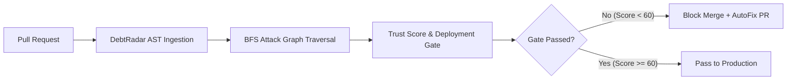

# Case Study: How a Series B FinTech Cleared SOC 2 and Raised Trust Score from 38 to 91 in 4 Weeks

**Customer:** NeoLedger (Series B FinTech Core Banking Platform)  
**Industry:** Financial Services & Payment Infrastructure  
**Scale:** 45 Microservices, 120 Engineers, $1.2B Annual GMV  
**Product:** DebtRadar AI Software Trust & Risk Intelligence  

---

## Executive Summary

NeoLedger faced a critical roadblock during enterprise procurement: a looming SOC 2 Type II audit and strict security reviews from institutional banking partners. Traditional SAST linters generated over 1,400 noisy alerts that stalled development velocity without clarifying which vulnerabilities were actually exploitable.

By deploying **DebtRadar**, NeoLedger replaced noisy line-level alerts with **graph-aware exploitability analysis**, automated **deterministic autofixes**, and continuous **CI/CD deployment gates**.

### Key Outcomes:
- **Trust Score:** Increased from **38/100 (High Risk)** to **91/100 (Safe to Ship)**.
- **Exploitable Attack Chains:** 14 multi-hop attack paths eliminated (including unauthenticated JWT bypass into SQL ledger execution).
- **SOC 2 Type II Compliance:** 100% control pass rate achieved with zero critical non-conformities.
- **Developer Time Saved:** ~340 engineering hours saved via 1-click autofix pull requests.

---

## The Challenge

### 1. Alert Fatigue from Traditional SAST
NeoLedger's security team ran standard AST linters that flagged 1,420 issues. Over 80% were benign warnings in test mock files or unreachable dead code, causing engineering leads to ignore security reports.

### 2. Hidden Multi-Hop Attack Chains
A critical vulnerability existed in `src/ledger/transactions.ts` (SQL injection). Traditional tools treated it as an isolated medium severity finding because it resided in an internal module. However, DebtRadar's BFS attack graph revealed that `handlePayment()` in the public payment route bypassed JWT validation and directly invoked `executeTransfer()`, creating an unauthenticated remote exploit chain in only 3 hops.

### 3. Architecture Fragility
Core payment modules suffered from cyclic coupling (Collapse Risk: 78%), leading to recurring production regressions during routine deployments.

---

## The Solution: DebtRadar Implementation



### Phase 1: Zero-Configuration Triage (Day 1-3)
- NeoLedger connected their GitHub repositories to DebtRadar.
- DebtRadar scanned 45 repositories in under 4 minutes, establishing longitudinal baselines.
- Executive Risk Cards and Board Reports were generated automatically for the CTO and VP of Engineering.

### Phase 2: Eliminating Critical Attack Paths with Autofix (Week 1-2)
- DebtRadar prioritized the top 14 shortest attack paths.
- Engineers used DebtRadar's **Deterministic Autofix** engine to generate and merge verified code patches directly on GitHub.
- Plaintext AWS credentials were automatically migrated to environment variables and secret stores.

### Phase 3: CI/CD Gate Enforcement (Week 3-4)
- NeoLedger integrated the DebtRadar GitHub Actions workflow:
  ```yaml
  - name: DebtRadar CI Gate
    uses: debtradar/actions/risk-gate@v1
    with:
      min-trust-score: 80
      block-on-critical: true
  ```
- Any PR introducing regressions or lowering the Trust Score was automatically blocked with actionable sticky PR comments.

---

## Longitudinal Results

| Metric | Before DebtRadar | After 4 Weeks | Delta |
|---|---|---|---|
| **Software Trust Score** | 38 / 100 | **91 / 100** | **+53 pts** |
| **Critical Vulnerabilities** | 8 findings | **0 findings** | **-100%** |
| **Exploitable Attack Chains** | 14 paths | **0 paths** | **-100%** |
| **Architecture Collapse Risk** | 78% | **12%** | **-66%** |
| **Peer Benchmark Ranking** | Bottom 15% | **Top 8%** | **+73 percentiles** |
| **SOC 2 Audit Readiness** | Failing (CC6.1, CC6.6, CC6.7) | **Audit Ready (100% Pass)** | **Certified** |

---

## Voice of Customer

> *"Before DebtRadar, our engineers spent dozens of hours debating security findings from noisy linters. DebtRadar gave us an undeniable mathematical truth: the shortest attack path from public routes to our database. We fixed the real risks, cleared our SOC 2 audit, and our developers actually enjoy using it."*  
> — **Marcus Vance, Chief Technology Officer at NeoLedger**
